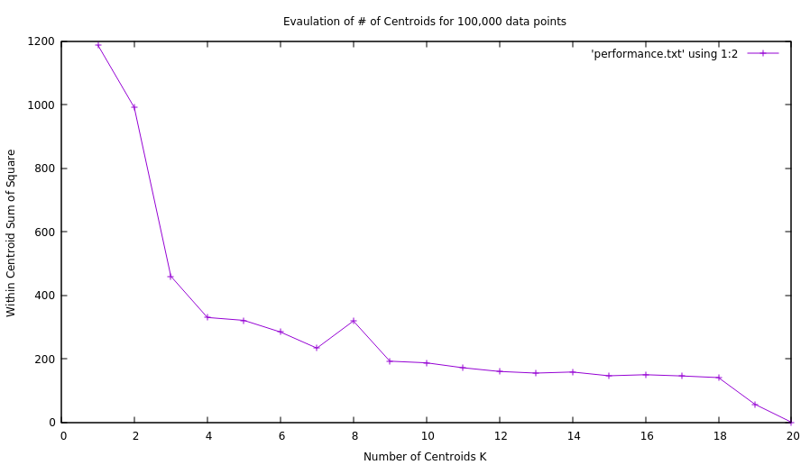

---
K-Means Implementation for Chicago Crime Analysis
---
This project was meant to be a showcase of a use-case for the common K-Means algorithm. K-Means is used to analyze all recorded crimes in the city of Chicago (dataset found here: https://www.kaggle.com/currie32/crimes-in-chicago#Chicago_Crimes_2012_to_2017.csv), identify high crime zones, and how they have shifted from 2001 to 2017.

Other Libraries Used:
  1. Boost - (input file parsing)
  2. GNUPlot - (visualization of results)

---
Overview
---
*Centroid.h* contains my implementation of a centroid or cluster, and also contains utility functions for the class such as adding and removing a data point from the centroid.

*fileutils.h* contains the definition of the data structure used to store crime records in, as well as a parsing function.

*KMeans.h* contains the actual algorithm implementation using the `Centroid` class and `CrimeRecord` structure.

---
Results
---

-> ELBOW METHOD

The K-Means implementation was first ran on only a percentage of the data. `N` was first chosen to be 100,000 and the number of centroids were varied from 1 -> 20. The within centroid sum of squares was calculated at each iteration, and the results were written to *results/ElbowMethodResults.txt*. GNUPlot was used to plot the results (see below). It is observed that there is a distinct "elbow" when the number of centroids is 4. After 4 centroids, there is not a great deal of improved performance in the algorithm for N = 100,000. Similar plots can be observed for a different number of data points.

-> GNUPlot Centroid Visualization

IN PROGRESS
