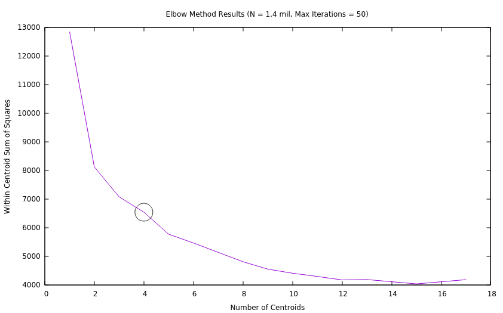

---
K-Means Implementation for Chicago Crime Analysis
---
This project was meant to be a showcase of a use-case for the common K-Means algorithm. K-Means is used to analyze all recorded crimes in the city of Chicago (dataset found here: https://www.kaggle.com/currie32/crimes-in-chicago#Chicago_Crimes_2012_to_2017.csv), identify high crime zones, and how they have shifted from 2001 to 2017.

Other Libraries Used:
  1. Boost - (input file parsing)
  2. GNUPlot - (visualization of results)

Outline below is the steps taken during the project.

---
Data Preprocessing
---

The data was read in from the CSV files to a vector of structs, defined in *fileutils.h*. The Boost library was used here as a method of iterating through the CSV file using the `boost::tokenizer` and `boost::escaped_list_separator`. The data was filtered to excluded any invalid records, which were considered any records with any missing columns. After filter the data, the number of records leftover was approximately 1.4 million points.

---
K Means Implementation Overview
---
*fileutils.h* contains the definition of the data structure used to store crime records in, as well as a parsing function.

*centroid.h* contains my implementation of a centroid or cluster, and also contains utility functions for the class such as adding and removing a data point from the centroid.

*kmeans.h* contains the actual algorithm implementation using the `Centroid` class and `CrimeRecord` structure. It also contains the implementation of the distance formula between two Lat/Long points. This uses the Haversine Formula within it.

---
Results
---

For all tests, the number of iterations was limited to 50. The Elbow Method was first used to determine the ideal number of centroids, and then the K Means implementation was ran using the ideal number of centroids identified for the number of data points used. The results were written to text files, and GNUPlot was used to plot every point, using the third column (centroid id it belongs to) as the color field.

-> ELBOW METHOD

The K-Means implementation was first ran on only a percentage of the data. `N` was first chosen to be 100,000 and the number of centroids were varied from 1 -> 20. The within centroid sum of squares was calculated at each iteration. GNUPlot was used to plot the results (see below). It is observed that there is a distinct "elbow" when the number of centroids is 4. After 4 centroids, there is not a great deal of improved performance in the algorithm for N = 100,000.

The elbow method results were then visualized for `N` with the full data set (~1.4 million points). It is observed that again, the ideal number of centroids is 4. When running the full implementation, 4 centroids were initialized from then on.

-> GNUPlot Centroid/Points Visualization

The plot below illustrates the results of the clustering algorithm using the full data set with a max number of iterations of 50. The number of centroids used was 5, as identified as the optimal number in the previous figure. The points are visualized based on their location, and colored based on the centroid they belong to. Each centroid is visualized as a circle with center placed at its identified location from the K Means method.

---
TO DO
---

The implementation still has to be run on the records of crimes before 2012, to visualize how the high crime locations have shifted. The other data files will be downloaded from the same source as above, and the same implementation will be followed.
